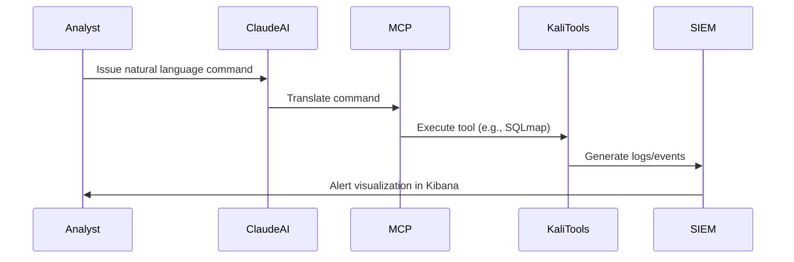

## Description
This sequence diagram shows the chronological order of interactions during MCP-driven penetration testing. Analysts issue commands to Claude AI, which are translated by MCP into tool execution. Logs are captured by SIEM and visualized for analyst review.

