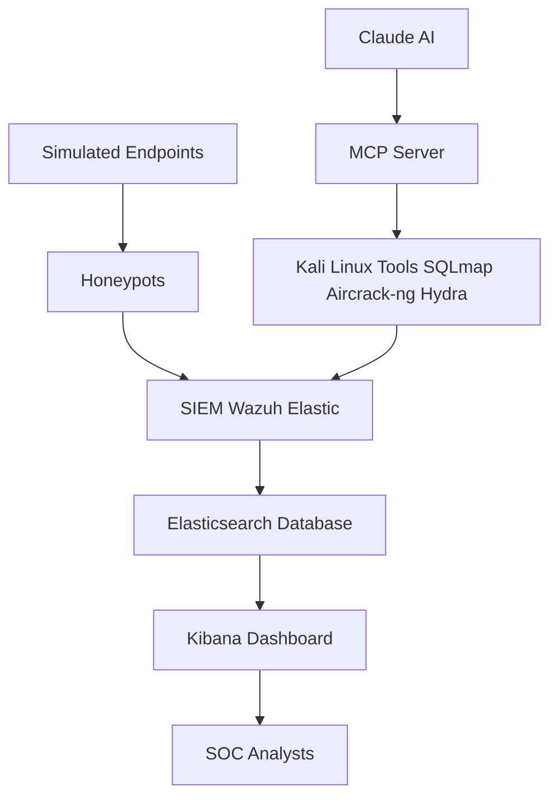

## Description 
This diagram shows the overall structure of the proactive cybersecurity assessment framework. Synthetic traffic flows from simulated endpoints into honeypots and SIEM. Claude AI, connected via MCP, drives penetration testing tools on Kali Linux, feeding results into the SIEM. Logs are stored in Elasticsearch and visualized in Kibana for SOC analysts.

