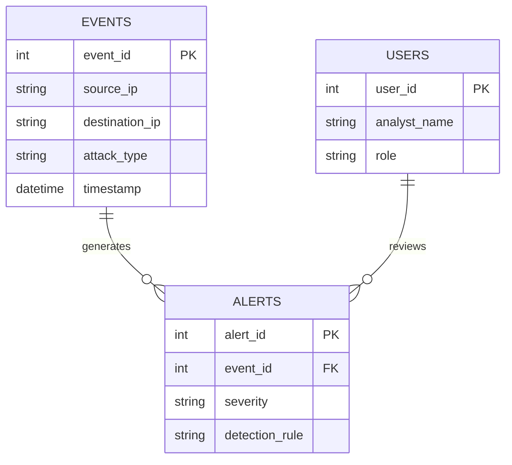

## Description
This ERD depicts the relationships between events, alerts, and SOC analysts. Events generated by honeypots or MCP-driven attacks are correlated into alerts, which analysts review and respond to.

